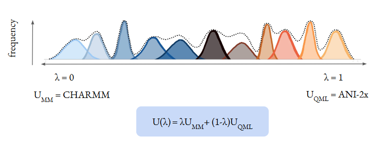

Theory
===============

## Equilibrium free energy endstate corrections

In equilibrium free energy calculations samples are drawn from the Boltzmann distrubtion 
at specific interpolation states between thermodynamic states (in our specific case: different energetic
descriptions of the molecular system, i.e. the source level of theory and the target level of theroy) and, 
given sufficient overlap of its pdfs, a free energy can be estimated. This protocol is expensive 
(it needs iid samples at each lambda state connecting the Boltzmann distribution at the endstates) 
but also reliable and accureate (with low variance).

## Non-equilibrium work protocol 

Non-equilibrium work protocols, and the fluctuation theorems connecting non-equilibrium driven 
processes to equilibrium properties, can be used to estimate free energy differences between different
levels of theory efficiently.
A specific NEQ protocol typically consists of a series of perturbation kernel .. math::\alpha_t(x,y)$ and a
propagation kernel $\kappa_t(x,y)$, which are used in an alternating pattern to drive the system
out of equilibrium.
Each perturbation kernel $\alpha$ drives an alchemical coupling parameter $\lambda$, and each 
propagation kernel $\kappa$ propagates the coordinates of the system at fixed $\lambda$ according 
to a defined MD process.
The free energy difference can then be recovered using either the Jarzynski equation (if initial conformations 
to seed the NEQ protocol are only drawn from $\pi(x, \lambda=0)$ and the NEQ protocol perturbations only 
from $\lambda=0$ to $\lambda=1$) or the Crooks' fluctuation theorem (if samples to seed the NEQ protocol 
are drawn from $\pi(x, \lambda=0)$ and $\pi(x, \lambda=1)$ and the perturbation kernels are set for a bidirectinoal 
protocol).

## Free energy perturbation (FEP)

Here, we define FEP as a special case of the NEQ protocol (and the Jarzynski equation) in which the protocol 
consists only of a single perturbation kernel $\alpha_t(x,y)$, without a propagation kernel.
$\alpha_t(x,y)$ perturbates the alchemical DOF from one 'endstate', without any intermediate states, 
to another 'endstate'. 
In the limiting cases of infinitely fast switching the Jarzynski equality reduces to the well-known FEP equation:
$e^{-\beta \Delta F} = \langle e^{−β[E(x,\lambda=1)− E(x,\lambda=0)]} \rangle_{\lambda=0}$.
$\langle \rangle_{\lambda=0}$ indicate that samples are drawn from the equilibrium distribution $\pi(x, \lambda=0)$.
